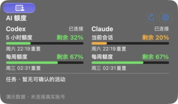

<div align="center">

# 奶灰桌宠

**桌面养只猫，顺便看一眼 AI 额度。**

一只会眨眼、打盹、玩球的奶灰小猫，陪你写代码，也提醒你 Codex 和 Claude 还剩多少额度。

[](https://github.com/freedomxia/naigrey-pet/releases/latest)


[**Windows 安装程序（.exe）**](https://github.com/freedomxia/naigrey-pet/releases/download/windows-v0.2.3/naigrey-windows-0.2.3-x64-setup.exe) · [**macOS 下载（.zip）**](https://github.com/freedomxia/naigrey-pet/releases/download/v3.4.0/naigrey-mac.zip) · [使用说明](使用说明.md) · [版本记录](https://github.com/freedomxia/naigrey-pet/releases)


<sub>奶灰的动作形象素材。实际运行会播放动画。</sub>

</div>

## 桌面上的小伙伴

待机时，小猫会呼吸、眨眼、看鼠标；摸摸头，它会眯起眼睛。想活动一下，就招招手、伸个懒腰、玩毛线球。累了也会趴下睡觉。

| 和它互动 | 它会做什么 |
| --- | --- |
| 单击 | 招手回应 |
| 双击 | 睡觉或醒来 |
| 拖动 | 搬到桌面上喜欢的位置 |
| 在头顶来回移动鼠标 | 享受摸摸头 |
| 点击猫咪的 AI 按钮 | 展开额度卡片 |
| 点击面板外 | 收起卡片，继续陪着你 |

菜单栏的猫爪图标里有完整开关。更多动作和设置见 [使用说明](使用说明.md)。

## Codex / Claude，抬眼就能看见

额度卡片横放在猫咪下方。需要时点开，看完点击别处自动收起；收起后仍会刷新额度并提醒。

<div align="center">


<br>


<sub>猫咪与面板分别截图。面板为演示数据，数值不代表真实账号。</sub>

</div>

| 功能 | 说明 |
| --- | --- |
| 额度查看 | 并排显示 Codex、Claude 当前窗口与每周额度 |
| 重置时间 | 可选择日期时间或倒计时 |
| 额度提醒 | 对齐 Codenotch v1.14.0 的已用 80% / 100% 阈值与重置提醒逻辑 |
| 提醒偏好 | 免打扰、声音、系统通知和轻动作联动可在齿轮设置中调整 |
| 本机账号 | 首次在面板连接本机已登录的 Codex / Claude 默认账号 |

Claude 按同组织 Desktop 缓存 → CLI `/usage` → OAuth 顺序读取。没有可用登录或读取失败时会提示状态，不会用演示值代替实际额度。

额度读取与提醒以 Codenotch v1.14.0 为对齐基准。具体覆盖范围见 [额度对齐记录](docs/AI-Codenotch对齐记录.md)，复用模块与许可证见 [第三方声明](THIRD_PARTY_NOTICES.md)。

## 安装，只需几步

### Windows 10 / 11（64 位）

1. [**下载 Windows 安装程序：naigrey-windows-0.2.3-x64-setup.exe**](https://github.com/freedomxia/naigrey-pet/releases/download/windows-v0.2.3/naigrey-windows-0.2.3-x64-setup.exe)。
2. 如果旧版正在运行，先从托盘退出奶灰。
3. 双击下载的 **`.exe`** 文件，按安装向导完成安装，再打开桌面快捷方式。

**不用下载压缩包，也不用解压。** GitHub Releases 中的 `Source code (zip)` / `Source code (tar.gz)` 是开发源码，不是安装程序。详细说明见 [Windows 使用说明](Windows/README.md)。

### macOS 13+（Apple 芯片）

1. [下载 macOS：naigrey-mac.zip](https://github.com/freedomxia/naigrey-pet/releases/download/v3.4.0/naigrey-mac.zip)。
2. 解压，把 `奶灰.app` 拖进「应用程序」。
3. 双击打开，在菜单栏找到猫爪图标。

> 当前安装包使用本机 ad-hoc 签名，尚未经过 Apple 公证。首次打开如果被系统拦截，可右键图标选择「打开」，或到「系统设置 → 隐私与安全性」查看「仍要打开」。

## 奶灰也会自己更新

每天最多自动检查一次，发现新版本会冒泡提醒。点击菜单里的「换上新衣服」，即可下载、校验、替换并重启，保留位置和设置。也可以随时点击「检查更新…」。

<details>
<summary>更新校验与备份机制</summary>

**macOS。** 更新源是这个仓库里的 [`updates/latest.json`](updates/latest.json)，安装包发在 Releases 里。因为 App 没有做公证，Gatekeeper 不会替你把关，所以更新器自己做了这件事：

- 每个安装包都用一把 Ed25519 私钥签名，公钥编译在 App 里，**签名对不上就直接丢掉**；
- 另外比对 SHA-256，用来发现下载不完整；
- 装之前还会检查解压出来的确实是同一个 App（bundle id 与构建号），并验证它的代码签名；
- 构建号只增不减，不会被降级；
- 换上去之前，旧版本会留一份在 `~/Library/Application Support/奶灰/backup/`。

私钥只存在发布者本机（`~/.naigrey/release-key`），不在仓库里。

**Windows.** 用同一把发布密钥，按 Windows 安装包自己的 SemVer 判断新旧，与 Mac 版本号无关。签名覆盖发布里的 `SHA256SUMS.txt`（安装包上限 512 MiB，没法整包读进内存验签），验签通过后才采信清单里的 SHA-256 去校验安装包——哈希只有这一个来源，所以效果等同于对安装包签名。缺少签名的发布不会被当作更新。Windows 仍在预览渠道，标记为 prerelease 的发布照常提示更新。细节见 [Windows 更新下载器](Windows/docs/updater.md)。

</details>

<details>
<summary>从源码构建与项目目录</summary>

### 本地构建

需要 Xcode 命令行工具。Claude 缓存所需的 Zstandard 解码器随源码静态编译，无需另外安装第三方包。

首次克隆后，先把仓库中的原始猫咪素材放到构建脚本要求的位置：

```sh
mkdir -p 奶灰.app/Contents/Resources
cp docs/images/cat-poses.png 奶灰.app/Contents/Resources/cats.png
./build.command
```

运行自检：

```sh
./Tests/verify.command     # 29 项桌宠自检
./Tests/verify-ai.command  # 7 组 AI 额度与联动测试
```

发布流程见 `Tools/release.command`，需要发布私钥和 `gh`。

### 源码目录

| 位置 | 是什么 |
| --- | --- |
| `Source/` | App 源码：素材切分、绑定与蒙版、Metal 渲染、动作行为、毛线球、视频片段、更新器 |
| `Assets/clips/` | 抠好的透明动作片段（HEVC with alpha）和它们的元数据 |
| `Tools/clips/` | 从绿幕视频里切片段的脚本 |
| `Tools/clipcheck/`、`Tools/preview/`、`Tools/fadecheck/`、`Tools/joincheck/` | 片段与画的猫并排比对、离屏预览动画、交接合成检查、动作接缝检查 |
| `Tools/relkey/`、`Tools/release.command` | 发布签名密钥工具与发布流程 |
| `验收记录.md` | 每个版本实测了什么、边界在哪 |

</details>

## 素材说明

猫咪形象与动作片段由 AI 生成后抠像处理，仅供个人使用。首页的猫咪和额度卡片截图来自实际应用。
