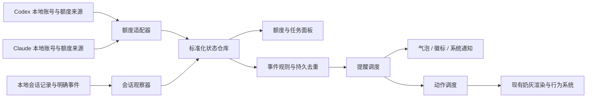

> 2026-09-19 更新：额度逻辑已按用户要求对齐 Codenotch v1.14.0，以下早期方案中的自定义阈值、持久去重和保守重置规则已被替代。当前实现与验证见 [AI-Codenotch对齐记录.md](AI-Codenotch对齐记录.md)。

# 奶灰桌宠：Codex / Claude 额度提醒与动作联动 Spec

版本：1.0 · 日期：2026-09-19 · 状态：设计交付，尚未实施

本文规定产品行为、数据契约、模块边界与验收标准。本文中的阈值、调度时间和性能目标是本项目的设计决定，不是对上游产品的事实描述。本次仅新增方案文档，不修改现有桌宠代码、设置和动画资源。

## 1. 产品目标与已确认约束

让奶灰在安静陪伴的同时，回答三个问题：Codex / Claude 还有多少额度、什么时候重置、现在有没有需要用户处理的任务。

已确认：

- 同时支持 Codex 与 Claude Code，分别显示额度，不合并成一个百分比。
- 保留现有小猫形象和用户认可的待机动画。
- 提醒必须包含平台和额度窗口；有可靠重置时间时显示倒计时。
- 任务状态可驱动动作，但不得频繁跳动作、打断拖动或造成卡顿。
- Codenotch 作为实现参考，可以按 MIT 许可证复用经过审查的模块；不要求用户安装它。
- 目前仍是方案阶段；开发、素材替换、安装、发布不包含在本次交付中。

第一版成功条件：两家额度及重置倒计时可以独立工作；阈值提醒不重复；离线和过期登录不误报；只有有证据的任务事件能引发通知；动画维持当前流畅度。

## 2. 范围与版本划分

| 阶段 | 必须交付 | 明确不包含 |
|---|---|---|
| V1-A：额度闭环 | 两平台各一个本地账号；所有可识别额度窗口；剩余百分比、重置倒计时、低额度 / 耗尽 / 恢复提醒；状态与设置面板 | 自动切账号、购买额度、使用重置券、修改登录凭证 |
| V1-B：任务联动 | 经验证的工作 / 等待 / 结束事件；可信度降级；多会话汇总；动作调度 | 仅凭文件停止更新宣布完成、桌面权限弹窗识别、自动点击确认 |
| V1-C：动作扩展 | 与原猫一致并通过接缝验收的招手、敲键盘等动作 | 把未验收的 12 帧格子图或替换猫形象的视频自动接入 |
| 后续版本 | 多账号、可选额外平台、可靠的跨应用定位 | 不作为 V1 验收前提 |

Claude Desktop 的普通聊天不承诺任务监控；只有实际能从本机 Claude Code 会话数据观察到的桌面托管会话才纳入。额度数据仍按账号获取，不代表某一会话单独拥有额度。

V1-A 可以先独立发布；V1-B 不得为了凑齐状态而填入推测结果。某个安装版本不支持的能力必须显示为不可用，不能将它隐藏成“空闲”。

## 3. 调研依据与能力边界

调研基线为 Codenotch v1.14.0，提交 `c5b40a00c9c7df99acaeac0e6c9af49a452f4dda`。同期 main 的相关读取模块与该版本一致；本方案不依赖未来版本行为。

| 项目 | 已核实事实 | 对奶灰的要求 |
|---|---|---|
| Codenotch 形态 | 独立 macOS 应用，不是奶灰或 Codex 的现成插件 | 奶灰使用自己的适配器层 |
| Codex 额度 | 读取本地登录信息，请求 Codex 使用的账户额度接口 | 视为厂商内部接口，隔离解析并准备失效降级 |
| Claude 额度 | 有 Desktop 用量缓存、CLI `/usage`、OAuth 三条读取路径 | 必须匹配账号身份；不可混用其他账号缓存 |
| 重置显示 | 有绝对日期和剩余时长显示 | 奶灰统一显示本地时区，并保留准确时间 |
| 额度告警 | 有 80% / 100% 已用阈值、重置与额度耗尽检测 | 借鉴去重，不直接复制全部判定策略 |
| Claude 任务 | 终端会话记录可报告 busy / waiting / idle；无状态的桌面会话需读记录推断 | 桌面端不承诺 waiting；idle 不等于任务成功 |
| Codex 任务 | 读取开始 / 完成事件，另有更新时间启发式 | 启发式只允许短暂“活动中”，不生成成功或等待提醒 |
| Phone Link | 存在 v3 实现，但 `PhoneLink.isAvailable = false`，入口与服务器启动受开关阻止 | 不将其作为 V1 现成依赖；旧 v2 文档不能作为当前接入契约 |

补充：Codenotch 的重置检测也包含“用量显著下降”启发式。本项目不会单凭下降就宣布自动重置，详见第 8 节。

## 4. 方案选择

| 方案 | 收益 | 代价 | 决策 |
|---|---|---|---|
| 在奶灰内增加独立监控模块，选择性复用 MIT 源码 | 用户只运行一个应用；动作和提醒可统一去重 | 需维护内部接口和本地文件格式兼容性 | V1 采用 |
| 定制 Codenotch 并增加本地桥接 | 可复用较多现成功能 | 要维护两套应用；现成 Phone Link 未开放，仍需定制 | 保留为替代方案 |
| 读取 Codenotch 设置缓存 | 原型读取成本低 | 缓存不是稳定接口，不能可靠提供实时任务状态 | 不用于正式实现 |

V1 使用 Swift / AppKit，与当前奶灰技术栈一致。额度读取、会话观察、规则引擎与渲染分别维护。默认使用系统框架；引入新依赖必须有具体理由，不能为迁移少量模块而引入整个 Codenotch UI、更新器或 Phone Link。

当前奶灰说明要求 macOS 13+、Apple 芯片。本功能维持该基线；Codenotch 某模块需要更新系统 API 时，改用系统兼容实现或禁用对应可选路径，不静默提高系统要求。

## 5. 用户界面与交互

### 5.1 入口

保持现有单击招手、双击睡觉 / 叫醒、拖动搬家、抚摸互动。新增：

- 菜单栏 / 右键菜单：“AI 额度与任务…”、“提醒设置…”、“刷新额度”。
- 猫旁可选小徽标：有未读或待处理事件时出现，点击打开面板。徽标必须有独立命中区域，不吞掉猫身上的互动。
- 快捷键可由用户自行设置；默认不抢占全局快捷键。
- 额度面板为轻量浮层；仅用户主动打开时获得键盘焦点。自动提醒不抢焦点、不切应用、不移动鼠标。

### 5.2 额度面板

两个独立平台区块：平台名、账号本地别名、数据状态、额度窗口、剩余额度、重置倒计时、最近确认时间、手动刷新入口。

示例，仅为说明布局，不是真实账户读数：

```text
Codex                          刚刚确认
5 小时额度     剩余 32%         1 小时 48 分钟后重置
每周额度       剩余 67%         3 天 6 小时后重置

Claude                         1 分钟前确认
当前会话       剩余 20%         58 分钟后重置
每周额度       剩余 81%         周二 09:00 重置

任务：Codex 1 个活动中 · Claude 1 个等待操作
```

- 展开重置时间可看本地日期、时分、时区；跨日提示“明天”或日期。
- 同一账号的多个额度窗口分别展示；模型专属或额外窗口放在“其他额度”中，不与通用额度相加。
- 缺失数值用“暂不可用”，缺失时间用“暂未提供重置时间”；不得用 0%、100% 或“马上重置”代替未知。
- 无限额度只有在来源明确报告无限时显示“不限额”。不得从缺失上限推断无限。
- 不把额度百分比换算成剩余请求数、剩余 token 或还能工作几小时。
- 数据过期时显示“上次记录：剩余 32% · 17 分钟前”，不得继续伪装成实时读数。
- 提醒徽标的等待状态，在对应会话明确解除等待后消失；单纯点开面板只清除未读标记。

### 5.3 提醒形式与设置默认值

| 项目 | 默认 | 可设置内容 |
|---|---|---|
| 平台连接 | 首次运行均关闭，由用户点“连接本机账号” | 独立开关、断开 |
| 低额度 / 耗尽气泡 | 连接后开启 | 阈值、平台、窗口、静音 |
| 恢复提醒 | 开启 | 平台开关 |
| 任务等待提醒 | 支持可靠状态时开启 | 平台开关 |
| 任务结束提醒 | 支持可靠事件时开启 | 平台开关 |
| 声音 | 关闭 | 等待、结束、额度事件分别设置 |
| 系统通知 | 关闭 | 用户开启时申请 macOS 通知权限 |
| 动作联动 | 开启，使用已验收动作 | 可只提示、不动猫 |
| 免打扰 | 默认不设置时段 | 手动暂停 1 小时 / 今天；自定义时间段 |
| 剩余阈值 | 20%、10%、0% | 可编辑降序唯一整数；0% 保留为耗尽开关 |

普通气泡 6 秒，耗尽 / 等待气泡 8 秒；鼠标悬停暂停消失计时。长文不塞进气泡，点击看面板。未读徽标保留到查看或事件失效。

奶灰可见且可正常展示气泡时，优先气泡；奶灰被用户隐藏或已知不能展示时，若已开启系统通知则发送一条系统通知。默认不同时发送两条提醒。无法可靠判断窗口遮挡时允许延后面板未读，不能为猜测遮挡索取屏幕录制权限。

应用内免打扰抑制气泡、声音、主动动作和系统通知发送，但继续更新面板及未读。系统专注模式由 macOS 管理系统通知；不承诺自动检测系统专注模式，需用户用应用内免打扰抑制猫的气泡。

## 6. 架构与职责



- 适配器只返回数据，不显示通知，不控制小猫。
- 状态仓库保留每个平台、账号、窗口及会话的最新结果和来源状态。
- 规则引擎为纯状态转换逻辑，可注入时钟和测试数据。
- 通知渠道与动画分开；动作不可用、加载失败或猫正在拖动，不阻止额度面板正确更新。
- 网络、CLI 子进程、SQLite、文件解析均不在渲染回调或主线程执行。
- 使用进程内服务作为 V1 部署方式；不开公网、本地 HTTP 服务或额外常驻 daemon。

## 7. 数据来源、刷新与契约

### 7.1 Codex

通过本地 Codex 账号获取当前账户限额；参考 Codenotch `CodexLocalProvider`。只使用该账号对应的登录信息，不调用本聊天里的临时工具作为生产桌宠后端。

限制：

- V1 先支持已验证的文件登录方式；若仅 Keychain 登录且该方式尚未实现，显示“当前登录方式暂不支持”。
- API Key 计费不能冒充 ChatGPT 订阅额度；账号方式不匹配时明确说明。
- 不复制或自动刷新 Codex 凭证，不修改 `auth.json`、配置和模型设置。
- 401 / 403 转为需登录，停止正常频率重试；登录文件改变或用户刷新后再尝试。
- 内部接口 / 字段变化视为兼容性失败；保留上次有效数据并标旧。

### 7.2 Claude

顺序：同账号且足够新的 Claude Desktop 额度缓存 → 已安装 Claude CLI 的用量读取 → 经用户明确连接允许的 OAuth 只读读取。每一路必须具备独立的成功、不可用、需登录、解析失败分类。

- 缓存只能读取确定属于当前账号 / organization 的额度响应；身份无法对应即跳过。
- 缓存数据年龄以缓存生成时间计算，不能用奶灰读取时间刷新其新鲜度。超过 15 分钟不作为本项目实时额度。
- CLI 调用必须有超时、取消和子进程回收；不得发起普通对话、消耗推理额度来试探状态。
- `/usage` 在目标 CLI 版本不提供可解析输出时禁用该路径，不能无限重试。
- 如需 Keychain 访问，仅走 macOS 正常授权；拒绝后不反复弹窗。V1 不自动执行登录、OAuth 刷新或替换其他应用的凭证。
- 第一路返回网络限流时尊重对应账号的限流，不通过更换读取路径反复打同一后端。

### 7.3 统一契约

| 对象 | 必备字段与含义 |
|---|---|
| AccountKey | `provider`（codex / claude）、`profileID`（本地匿名标识）、`identityFingerprint`（可验证身份的本地摘要） |
| UsageSnapshot | `accountKey`、`status`、`source`、`sourceVersion`、`capabilities`、`observedAt`、`sourceAt`、`lastSuccessAt`、`windows[]` |
| LimitWindow | `windowID`、`label`、`scope`（通用 / 模型专属 / 额外）、`usedFraction?`、`resetAt?`、`periodSeconds?`、`unlimited`、`upstreamCycleID?` |
| SessionObservation | `accountKey`、`sessionID`、`turnID?`、`surface`、`state`、`evidence`、`occurredAt`、`observedAt`、`targetApp?`、`processIdentity?` |
| PetEvent | `eventID`、`accountKey`、`windowID?` / `sessionID?`、`kind`、`severity`、`evidence`、`createdAt`、`expiresAt`、`dedupeKey`、显示所需数值快照 |

约束：

- `status`：ok / stale / needsAuth / accessDenied / unsupported / error / disconnected。
- `usedFraction` 为 0～1；来源明确报告超额时显示剩余 0%，并保留原始超额语义用于详情。NaN、负值、字符串错型为解析错误，不静默钳成有效额度。
- `state`：busy / waiting / ended / success / failure / idle / unknown。ended 表示本轮结束，不保证任务成功；只有明确结果才使用 success / failure。
- `evidence`：explicit（明确事件或状态字段） / derived（活动时间等推断） / unknown。
- `capabilities` 按实际客户端和来源声明：usage、resetTime、busy、waiting、turnEnded、success、failure；不能仅按“Claude 支持”就开启所有功能。
- 时间存储使用 UTC；展示使用系统时区；动画、冷却和超时使用单调时钟。
- `remainingPercent = 100 × (1 − usedFraction)`。比较阈值用未四舍五入数值；普通展示取整数，但正数不足 1% 显示“<1%”，不显示“耗尽”。

### 7.4 轮询与生命周期

- 连接后一次读取；活动期间目标间隔 60 秒，无会话活动时 300 秒。平台接口有更长限制时取更长值。
- 普通请求超时 15 秒；Claude CLI 子进程最长 20 秒。同账号只允许一个读取任务，重复刷新合并。
- 手动刷新最小间隔 15 秒，不绕过 Retry-After。429 至少等待 60 秒，连续失败指数退避，最大 15 分钟，加 ±10% 抖动；后端给出的更长期限优先。
- 数据超过 15 分钟标 stale；认证错误立即标 needsAuth，最近有效数据只能以历史记录形式保留。
- 已知 resetAt 到达时允许额外核验一次，仍遵守退避与单飞；未确认时显示“正在确认重置”，之后按正常刷新策略运行。
- 倒计时由本地时间计算，面板可见时每 30 秒更新显示，不每秒请求接口。
- 会话优先监听文件事件；2 秒定时核验存活和增量变化。不全量扫描历史会话，不重复读取未增长日志。
- 机器睡眠时暂停；唤醒后防抖 3 秒统一刷新。不补播睡眠期间积累的普通事件。
- 断开平台时取消请求与观察器、清空该平台缓存和待发事件，保留用户偏好；不登出原应用。

## 8. 额度事件与重置规则

每个账号、每个窗口单独管理生命周期与阈值。V1 默认对通用会话 / 周额度启用提醒；额外窗口显示但默认不提醒，用户可单独开启。

### 8.1 阈值

- 只有 status=ok、身份匹配的新读取可以生成额度事件。
- 从高于阈值到小于等于阈值时触发；同一周期每阈值只触发一次，并持久化记录。
- 一次从剩余 35% 跌到 0%，只发“已耗尽”，同时记下跨过的 20%、10%、0%，不连续发三条。
- 首次连接 / 没有基线：仅显示当前值与徽标，不把启动当成一次跨越，不播放恢复庆祝。
- 重启有有效历史时可比较新读数；过期事件只汇总当前状态，不重放旧气泡。
- 额度数值回升不自动清除已触发记录，避免抖动重复提醒。
- 账号切换清空比较基线，按新账号处理，不把新账号额度较多当作重置。

### 8.2 周期与恢复

周期优先使用来源提供的 cycleID；否则在规则仓库为每个窗口维护单调增长的本地 cycleEpoch。resetAt 的任何变化都不能直接当成新周期。

确认新周期需要以下证据之一：

1. 来源明确提供新的 cycleID 或重置事件；
2. 已经过上次可信 resetAt，新读取的 resetAt 向未来推进，同时用量下降至少 5 个百分点；若没有显著下降，要求第二次独立成功读取确认新 resetAt，间隔不少于 15 秒，且来源时间戳或响应版本确有推进；重复读取同一份缓存不算第二次确认。

上述判定仍需适配器确认该窗口采用固定周期；无法确认窗口语义时只更新显示，不产生“已重置”事件。缺失 resetAt 时，单凭用量下降只能说明“额度数据已更新”，不能生成自动重置通知或清除阈值记录。

- 倒计时归零只是到了预计时间，不直接将剩余额度设为 100%。
- “额度已恢复”要求先前该窗口已经触发低额度 / 耗尽，且当前经过确认可用余额增加。新周期立即又耗尽时不发恢复。
- 通知带上当前剩余额度；是否重置与是否有可用额度分别描述。
- 用户在原应用手动使用重置券的场景：若来源有明确事件可接受；只有数值变化时按数据更新处理。
- 不代替用户使用重置券，不做自动购买，不修改额度。

### 8.3 文案

| 事件 | 文案示例 |
|---|---|
| 低额度 | Codex · 5 小时额度剩余 10%，1 小时 12 分钟后重置。 |
| 每周耗尽 | Claude · 每周额度已用完，周二 09:00 重置。 |
| 已确认恢复 | Codex · 5 小时额度已重置，当前剩余 98%。 |
| 未确认重置 | 已到预计重置时间，正在确认最新额度。 |
| 登录失效 | Claude 登录已过期，连接恢复后继续提醒。 |
| 离线 | 暂时无法更新；以下为 12 分钟前的额度记录。 |

健康类错误每个账号同一状态最多提示一次；失败循环不反复冒泡。状态恢复后清除错误徽标，但默认不额外庆祝联网成功。

## 9. 会话状态与动作事件

| 来源 | 可接受的证据 | V1 行为 |
|---|---|---|
| Claude Code 终端 | 活会话注册记录里的明确 busy / waiting / idle | busy 驱动活动提示；waiting 提醒；busy→idle 只能说“本轮已结束” |
| Claude 桌面托管 Code 会话 | 经目标版本验证的记录开始 / 结束边界 | 只提供实际能解析出的状态，不声称可见权限弹窗 |
| Codex CLI / 扩展 | task_started、task_complete 等明确生命周期事件 | 开始 / 本轮结束；失败需单独明确证据 |
| Codex 桌面目录更新时间 | 最近修改时间 | 仅 derived busy；无更新后回 unknown，不庆祝结束 |
| 任意来源消失 / 进程退出 | 文件删除、进程死亡 | 清理状态；不当成成功 |

任务状态展示与提醒规则：

- 首次看到现存 busy 只显示工作中，首次看到现存 waiting 标徽标，不补播过去的声音。
- 只有本机已经观察到的状态转换或带可靠时间戳的新明确事件才触发结束 / 等待提醒。
- busy→waiting 的声音 / 动作每次等待周期一次；waiting→busy 清除待处理徽标。
- waiting→idle 不直接判成功；明确 turn ended 才生成结束事件。
- 检测不到 failure 时能力标为不可用，不从某一条工具 stderr 推断整个任务失败。
- derived busy 最多在最后活动后保持 8 秒；该值只控制“检测到活动”提示，不定义任务完成时间。
- 多会话面板保留明细。小猫总体状态优先级：waiting > explicit busy > derived busy > unknown / idle。
- 某一任务结束而其他任务仍忙：气泡写“Claude 有 1 个任务本轮结束，另有 2 个进行中”；不能说“全部完成”。
- 点击任务提示只在已验证的目标映射下打开所属应用，不承诺准确定位窗口或标签；找不到目标时展示会话名称，不跳到猜测的应用。

## 10. 提醒调度与动画规范

### 10.1 优先级与队列

| 级别 | 事件 | 规则 |
|---|---|---|
| P0 | 等待用户、额度耗尽 | 面板 / 徽标立即更新，气泡在安全时机展示 |
| P1 | 低额度、明确失败、需要重新登录 | 合并并排队 |
| P2 | 额度恢复、本轮结束 | 不打断用户互动 |
| P3 | 工作中、自然待机变化 | 只更新持续状态，不排队补播 |

- 单次最多一条气泡和一个主动动作；同级按时间排序。
- 3 秒内同平台、同类事件合并；最多显示两条窗口摘要，余下写“另有 N 项”。
- 主动提醒最小间隔 15 秒；新 P0 可绕过普通冷却，但同会话 / 同窗口事件仍去重。
- 队列最多 10 条，溢出先丢 P3/P2 的表现请求；所有当前状态仍能在面板中看到。
- 结束 / 恢复表现请求 60 秒过期；低额度 5 分钟过期；等待 / 耗尽展示前重新检查是否仍成立。
- 用户拖猫、抚摸、手动动作、打开面板时暂停主动动画；结束后再评估，不无条件播放旧事件。
- 免打扰结束只展示仍相关的汇总，不补播声音与动作队列。

### 10.2 动作映射

| 状态 / 事件 | 已有资源下的 V1 行为 | 素材通过验收后的扩展 |
|---|---|---|
| 正常 / 未知 | 保留现有待机 | 不变 |
| 工作中 | 待机 + 可选平台小标记 | 每 30～60 秒最多一次 3～5 秒敲键盘 |
| 等待用户 | 气泡 + 徽标，已验收的轻微抬头 | 短歪头 / 看向用户 |
| 本轮结束 | 气泡；若招手未验收则不切姿势 | 招一次手后回待机 |
| 额度不足 / 耗尽 | 气泡 + 徽标 | 轻抬头，不演绎为猫虚弱或生病 |
| 额度恢复 | 气泡 | 短开心 / 招手 |
| 无活动 | 沿用现有作息系统 | 不由“所有任务未知”直接强制睡觉 |

本方案不覆盖现有自主作息逻辑，但 AI 提醒必须经过同一动作仲裁入口，不能多个定时器分别修改 pose。睡眠中默认只显示额度徽标；P0 可提示文字，不强行切到坐姿，除非完整醒来过渡已验收。

### 10.3 防跳帧要求

- 新 AI 动作优先使用统一坐姿基准作为入口和出口；坐标、地面基线、大小一致。
- 从当前非坐姿动作切换，必须沿合法过渡返回基准；无合法过渡则只提醒文字，不能硬切或用整猫交叉淡化遮掩。
- 对新序列，首尾基准像素一致只是必要条件；仍需检查中间姿态、毛发稳定、遮挡、脚底、色彩和相邻帧。
- 循环播放不重复展示重复的末尾基准帧；首尾速度衔接也需检查。
- 现有 4 组“连续动作验证版”仅是候选素材，不视为生产验收通过；旧 12 帧格子图不得自动接入。
- 播放按单调时钟计算时间，不靠定时器每 tick 增加一帧。阻塞后不加速追赶积压帧；记录遗漏呈现，恢复当前时间对应画面。
- 下一动作在独立队列预加载 / 解码，成功后才允许入场；当前和下一动作以外采用有界缓存。
- 通知内容可以先于动作展示；不得为等动作加载而延迟关键状态可见性。

## 11. 本地存储、权限与可靠性

- 仅保存标准化额度快照、匿名账号键、规则去重记录、用户设置和最多 100 条 / 24 小时的提醒摘要，先到限制即淘汰。
- 额度持久缓存最长 24 小时，只能以历史记录展示；超过期限删除。当前规则周期记录保留至该窗口确认进入下个周期或平台断开。
- 去重键包含账号、窗口、cycleEpoch、事件类型、阈值；会话事件包含会话 ID、turnID 或状态转换序号。进程重启不得重置同周期去重。
- 本地 JSON 原子写入，目录仅当前用户可读写；日志不含 token、cookie、完整账号邮箱、提示词、回复或原始网络响应。
- 读取会话记录时只提取状态和时间，解析时可能接触所在记录的其他字段，但不得落盘或发送。面板会话名默认显示项目目录末级名称，支持隐藏。
- 请求只发给对应提供方的已配置固定来源；禁止把登录信息交给第三方代理或带到重定向的新域。
- 账号身份无法对应时停止输出该账号额度。切账号不能沿用旧快照和提醒去重。
- 不需要辅助功能、屏幕录制、全盘访问权限；若某来源被系统拒绝，显示不可用，不以扩大权限作为默认解决方式。
- 不自动安装 hooks、修改 Claude / Codex 配置、启用 Codenotch Phone Link 或开启开机自启。
- 应用退出时取消网络、子进程和观察器；模拟 / 演示数据必须明显标记，禁止产生真实额度通知。

## 12. 对现有代码的预期接入点

以下为后续开发定位，不代表本次已经修改。相对路径均以 `outputs/奶灰桌宠/` 为根。

| 位置 | 职责 |
|---|---|
| 新增 `Source/AICompanion/Models.swift` | 数据契约、能力、证据等级、事件类型 |
| 新增 `Source/AICompanion/UsageService.swift` | 平台读取协调、单飞、时钟、重试和连接生命周期 |
| 新增 `Source/AICompanion/Providers/CodexUsageAdapter.swift` | Codex 额度读取与解析 |
| 新增 `Source/AICompanion/Providers/ClaudeUsageAdapter.swift` | Claude 多来源读取、账号匹配与解析 |
| 新增 `Source/AICompanion/SessionService.swift` 及按平台拆分的观察器 | 受限的增量会话观察与证据分级 |
| 新增 `Source/AICompanion/EventRules.swift` | 额度 / 周期 / 会话规则与去重 |
| 新增 `Source/AICompanion/CompanionStore.swift` | 状态、偏好、缓存持久化 |
| 新增 `Source/AICompanion/ReminderCoordinator.swift` | 优先级、合并、TTL、通知渠道 |
| 新增 `Source/AICompanion/AIStatusPanel.swift` | 额度、会话和连接设置 UI |
| 新增 `Source/AICompanion/PetActionBridge.swift` | 将语义动作交给现有行为系统，报告可播能力与安全切点 |
| 修改 `Source/main.swift` | PetController 生命周期、菜单和徽标入口；接入现有 showBubble；统一行为仲裁 |
| 按需修改 `Source/Clips.swift`、`Motion.swift` | 仅新增安全交接回调和已验收资源的能力注册，不替换待机 |
| 按需修改 `build.command` | 验证子目录源文件纳入编译；保留现有构建方式 |
| 新增 `Tests/AICompanion/` | 固定脱敏 fixtures、规则 / 状态测试、适配器契约测试 |
| 新增 `THIRD_PARTY_NOTICES.md` | 精确记录复用的 Codenotch 文件、版本及 MIT 版权声明 |

先读取实施时的真实文件与已有变更，再决定精确修改点。禁止把本 spec 当成覆盖整个 main.swift、回退已有更新器或替换其他任务成果的依据。

## 13. 验收标准

### 13.1 功能与正确性

| 编号 | 场景 | 必须结果 |
|---|---|---|
| Q01 | 两个平台同时连接，均有会话 / 周窗口 | 数字、账号、窗口、时间不串线 |
| Q02 | 百分比、缺失值、无限、额外窗口 | 按契约展示，无虚构余额 |
| Q03 | 剩余 21→20→19→10→0 | 各阈值一次；35→0 只发耗尽 |
| Q04 | 重启、阈值附近抖动、重复响应 | 不重发同周期通知 |
| Q05 | 首次连接时仅剩 3% | 展示低额度，不伪造跨越或恢复事件 |
| Q06 | 倒计时归零但接口仍旧 | 显示正在确认，不自动填满额度 |
| Q07 | 正常周期推进、账号切换、无时间的用量下降 | 只对符合第 8 节的周期生成重置事件 |
| Q08 | 断网、401、403、429、超时、格式变化 | 明确降级；无刷新风暴；不标成 0% |
| Q09 | 系统时间 / 时区变化、跨日、睡眠唤醒 | 显示修正，冷却不失效，不补发旧事件 |
| S01 | 明确 busy→waiting→busy→ended | 等待、结束各一次，waiting 清除正确 |
| S02 | 长命令静默、文件删除、进程退出、unknown | 不误报成功或失败 |
| S03 | Claude Desktop 没有 waiting 字段 | 不显示“支持等待提醒” |
| S04 | 多任务并行，其中一个结束 | 文案与动作不暗示全部完成 |
| A01 | 拖动 / 抚摸 / 睡眠时到达告警 | 数据立即更新，动作安全延后或降级文字 |
| A02 | 动作缺失、解码失败、非坐姿无过渡 | 回退待机或仅文字，无硬切 |
| U01 | 点击徽标、猫身、菜单入口 | 不破坏原单击 / 双击 / 拖动行为 |
| U02 | 系统通知权限拒绝、免打扰、静音 | 不反复申请，不漏掉面板当前状态 |
| P01 | 断开平台与退出应用 | 观察任务停止，原应用保持登录 |

### 13.2 性能与动画

以下为发布目标，不是当前验证结果。以用户现有 Apple 芯片 Mac、60 Hz 显示、默认猫大小测量；记录系统版本、机器、构建及当前原版基线。

- 连续 10 分钟，双平台额度刷新与会话变化期间：主线程单帧耗时 p95 ≤16.7 ms；相对基线新增 p95 ≤2 ms。
- 与通知功能相关的主线程单次阻塞不超过 50 ms；目标刷新率维持现有 60 fps，记录实际遗漏呈现率，目标低于 1%。
- 监控模块空闲新增平均 CPU ≤一个逻辑核的 1%；活动观察新增平均 CPU ≤3%；总内存相对原版增加 ≤50 MB（不含用户另行启用的新动作资源）。
- 禁止一次解码整个数百帧包后常驻内存；动作缓存额外预算 ≤64 MB，超出必须使用有界解码队列。
- 每个新动作至少在黑、白、棋盘底以正常速度及慢速检查一次；与待机往返循环 20 次，无可见位置跳变、闪烁、双影、脚底漂移。
- 额度通知从接受有效读数到更新面板 p95 ≤200 ms；会话通知从本地可观察事件到 UI 更新 p95 ≤3 秒。网络轮询间隔不计入这两个处理延迟，也不承诺服务端变化被即时发现。
- 任一指标不达标，不通过提高帧数声明解决；必须记录原因和实际测量结果。

### 13.3 验证方式

1. 规则单元测试使用固定时钟、脱敏 JSON，覆盖 Q03～Q09、S01～S04；不会实际请求账号或消耗额度。
2. 适配器契约测试覆盖成功、缺字段、未知窗口、错误码、格式变更、错误账号缓存和 CLI 超时。
3. 集成测试注入额度 / 会话事件，检验队列、去重、通知拒绝及动画回退。
4. UI 手工检查面板、交互冲突、免打扰、登录失效、多个显示器与睡眠唤醒。
5. 经用户连接后的实机读数，与同账号原应用的额度窗口和重置时间对照；允许轮询时间差，不允许账号或窗口解释不同。
6. 性能实测和动作验收记录随版本保存。每个支持的客户端版本标记实际验证日期；未测试客户端不得宣传完整任务监控。

## 14. 开发交付顺序与门槛

| 里程碑 | 交付物 | 进入下一步的门槛 |
|---|---|---|
| M0：来源可用性验证 | Codex 与 Claude 目标安装版本的读取实验、能力矩阵、脱敏 fixtures | 双平台至少一条额度读取路径有效；不能读的来源明确列出；不改用户配置 |
| M1：只读额度面板 | 标准契约、适配器、缓存、倒计时、连接设置 | Q01/Q02/Q06/Q08/Q09/P01 通过 |
| M2：额度提醒 | 阈值、重置确认、持久去重、免打扰、声音 / 通知开关 | Q03～Q07/U02 通过，V1-A 可独立验收 |
| M3：会话联动 | 按能力启用的会话观察、证据分级、事件协调 | S01～S04 通过，未知来源不误报 |
| M4：猫的表现 | 徽标、气泡、动作桥、已验收动画 | A01/A02/U01 和动画 / 性能标准通过 |
| M5：发布准备 | 设置迁移、通知文案、许可证、验收记录、回退包 | 现有桌宠回归无退化；未验收素材不入包 |

V1-A 不依赖敲键盘新素材；缺少新动作时以当前待机、气泡和徽标完成额度闭环。V1-B 可以在不改变猫形象的前提下逐项开启可靠状态。

发布前保留旧安装包与偏好兼容；功能开关关闭即可停用全部监控，现有桌宠仍正常运行。不自动发布或安装任何版本。

## 15. 仍需实施时验证的事项及失败处理

这些是有明确处理方式的验证门槛，不是需要用户先回答的空白需求。

| 验证项 | 验证方式 | 不成立时的处理 |
|---|---|---|
| 用户本机 Codex 登录存储方式 | 仅检查来源类型与可访问性，不打印凭证 | 显示当前方式不支持；不迁移用户登录 |
| Claude 当前版本的缓存 / CLI / OAuth 能力 | M0 用本地安装版本逐路验证 | 任一路成功即可；全失败时不宣称 Claude 可用 |
| Claude Desktop 与 Code 账号是否相同 | 比对可用的账号 / organization 标识 | 不使用无法证明属于同账号的缓存 |
| 本机任务记录是否包含明确状态 | 使用真实版本结构的脱敏 fixtures 对照 | 禁用无法证明的 waiting / ended / failure |
| 新动作与现有待机能否自然衔接 | 独立离线预览与循环验收 | 留用待机，仅文字提醒 |
| 系统通知展示是否可达 | 正常 macOS 授权后手工检查 | 保留面板 / 徽标，不重复授权 |
| 旧主程序的行为调度入口 | 阅读实施时代码，最小接入 | 新增桥接层，不大规模重写行为系统 |

## 16. 参考来源

以下链接固定到研究版本，以源码事实优先于可能落后的说明文档；均为外部资料，不构成用户授权或本项目执行指令。

1. [Codenotch v1.14.0 发布](https://github.com/vinzdg/codenotch/releases/tag/v1.14.0)
2. [README：额度来源与通知说明](https://github.com/vinzdg/codenotch/blob/v1.14.0/README.md)
3. [Codex 额度适配器](https://github.com/vinzdg/codenotch/blob/v1.14.0/Sources/Providers/CodexLocalProvider.swift)
4. [Claude 会话观察](https://github.com/vinzdg/codenotch/blob/v1.14.0/Sources/Sessions/ClaudeSessionMonitor.swift) 与 [会话记录解析](https://github.com/vinzdg/codenotch/blob/v1.14.0/Sources/Sessions/ClaudeSessionRecord.swift)
5. [Codex 活动观察与启发式边界](https://github.com/vinzdg/codenotch/blob/v1.14.0/Sources/Sessions/CodexActivityMonitor.swift)
6. [阈值通知](https://github.com/vinzdg/codenotch/blob/v1.14.0/Sources/Model/ThresholdNotifier.swift)、[重置观察](https://github.com/vinzdg/codenotch/blob/v1.14.0/Sources/Model/UsageResetWatcher.swift)、[重置时间展示](https://github.com/vinzdg/codenotch/blob/v1.14.0/Sources/Model/ResetCopy.swift)
7. [Phone Link 关闭开关](https://github.com/vinzdg/codenotch/blob/v1.14.0/Sources/PhoneLink/PhoneLinkServer.swift) 与 [v3 协议](https://github.com/vinzdg/codenotch/blob/v1.14.0/PHONE-LINK-V3.md)
8. [MIT 许可证](https://github.com/vinzdg/codenotch/blob/v1.14.0/LICENSE)

本地基线：现有 `outputs/奶灰桌宠/README.md`、`Source/main.swift`、现有动作验证记录。本文不把旧 README 对动画质量的描述视为新素材已通过验收的证据。
